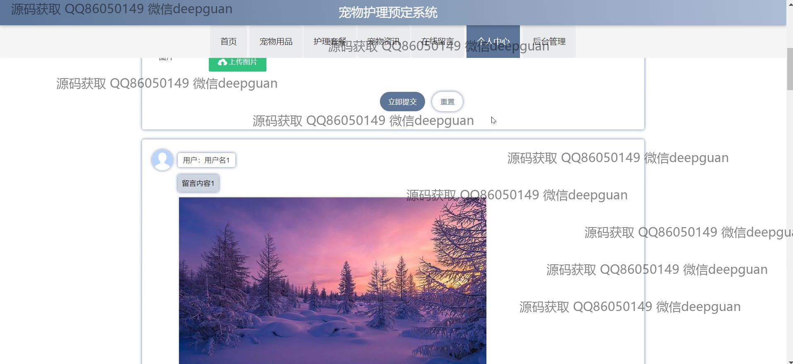
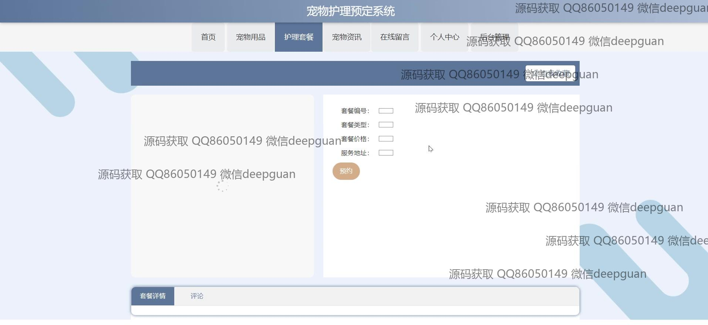

<h1 align="center">宠物护理预定系统</h1>

## 简介
宠物护理预定系统：角色分为管理员和用户；主要功能包括宠物用品管理、护理套餐管理、预约服务管理、会员用户管理、在线留言及支付功能，界面设计简洁直观，用户交互性强。    --计算机毕业设计源码；毕设源码；java毕业设计源码

## 联系方式

<h3 align="center">获取完整代码与数据库文件 + 微信：deepguan QQ: 86050149 QQ群: 783742310</h3>

<h3 align="center">可帮忙远程部署 包运行成功！提供远程部署、修改代码、设计文档指导、代码讲解等服务！</h3>

## 功能介绍（完整见运行截图）
管理员：管理员可以访问后台管理界面，进行系统所有功能模块的管理，包括用户管理、宠物种类管理、用品管理、护理套餐管理及订单管理等，审核用户预约请求，并可通过界面功能进行信息的添加、修改、查看、批量删除和审核操作，确保系统的高效运行及用户信息安全。  
会员用户：会员用户可以在前台浏览网站，通过简单的注册流程后，访问个人中心进行个人信息的修改，管理个人预约信息，留言反馈与回复，并查看订单及进行各类宠物护理套餐和用品的分类查询与选择，预约所需的护理服务，支持多种支付方式。

## 运行截图

本代码来源于网络,仅供学习参考使用!

